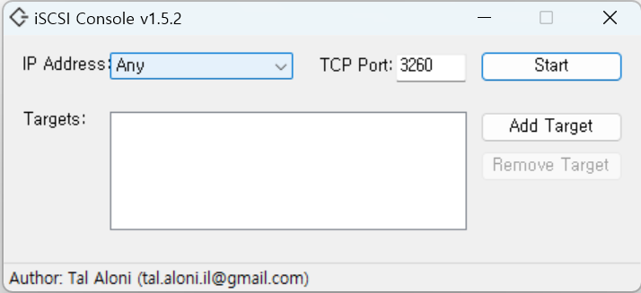
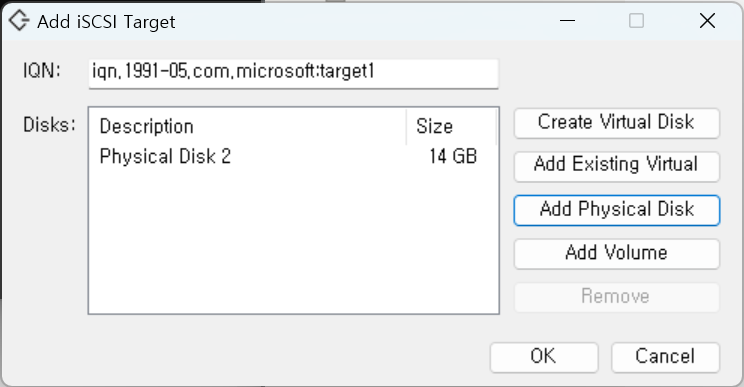
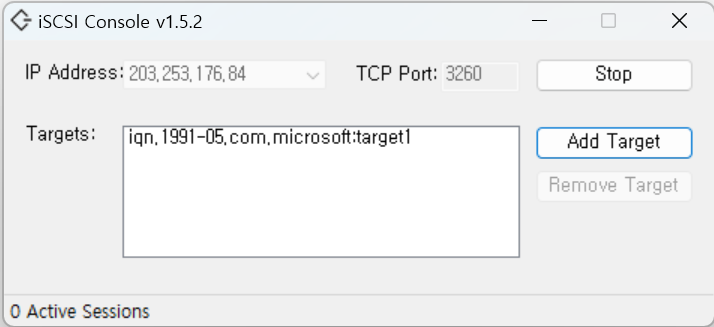

## Prerequisite
- WSL2 (Ubuntu 18.04 LTS or higher, currently 22.04 tested)
- Visual Studio
- .NET Framework (3.5 or 4.*)

## Instructions
- 빌드 관련 패키지 설치
```bash
$ sudo apt install build-essential flex bison dwarves libssl-dev libelf-dev libncurses5-dev git bc
```

- 현재 WSL2 커널 버전 확인
```bash
$ uname -r
5.10.102.1-microsoft-standard-WSL2+
```

- WSL2 커널 소스 clone (현재 커널 버전에 맞게 브랜치 설정)
```bash
$ git clone --branch linux-msft-wsl-5.10.y https://github.com/microsoft/WSL2-Linux-Kernel.git
$ cd WSL2-Linux-Kernel
```

- 아래와 같이 menuconfig 설정 후 저장
```bash
$ export KCONFIG_CONFIG=Microsoft/config-wsl
$ make menuconfig
```
```bash
[*] Enable loadable module support

General setup  --->
    [*] Initial RAM filesystem and RAM disk (initramfs/initrd) support

Device Drivers --->
    [*] Multiple devices driver support (RAID and LVM) --->
        <*> Device mapper support
    [*] Block Devices ---> 
        <*> Loopback device support 
    SCSI device support  --->
        <*> SCSI device support --->
        <*> SCSI disk support
        <*> SCSI generic support
        SCSI Transports --->
        <M> iSCSI Transport Attributes
        [*] SCSI low-level drivers  --->
        <M> iSCSI Initiator over TCP/IP     

File systems ---> 
     <*> FUSE (Filesystem in Userspace) support 

[*] Networking support  --->
   Networking options  --->
      [*] TCP/IP networking
```
- 커널 컴파일
```bash
$ sudo make KCONFIG_CONFIG=Microsoft/config-wsl -j$(nproc)
```

- iSCSI 모듈 설치
```bash
$ sudo make modules_install
```

- 새로 생성한 커널 이미지(bzImage)를 현재 Windows(host)에 복사
```bash
$ cp ./arch/x86_64/boot/bzImage /mnt/c/Users/현재_윈도우_사용자명/
```

- Windows(host)의 사용자 디렉터리에 “.wslconfig” 파일 생성 후 아래와 같이 작성하여 저장
```bash
$ sudo vi /mnt/c/Users/현재_윈도우_사용자명/.wslconfig

[wsl2]
kernel=C:\\Users\\현재_윈도우_사용자명\\bzImage
swap=0
localhostForwarding=true
```

- WSL2 종료 후 재시작
```bash
> wsl -d Ubuntu-18.04 --shutdown 
> wsl -d Ubuntu-18.04
```

- iSCSI module 로드
```bash
$ sudo modprobe -v libiscsi
$ sudo modprobe -v scsi_transport_iscsi
$ sudo modprobe -v iscsi_tcp
$ sudo modprobe -v libiscsi_tcp
```

- open-iscsi 설치
```bash
$ sudo apt install open-iscsi
```

- iscsi initiator 시작
```bash
$ sudo /etc/init.d/open-iscsi start
```

## WSL2에 USB 연결
- Windows(Host)에서 iSCSIConsole 프로젝트(https://github.com/TalAloni/iSCSIConsole) 다운로드 후 빌드
- 관리자 권한으로 iSCSIConsole 실행
<p align="center">
 
</p>

- iSCSI Console에서 Target USB 추가 (Add Target →Add Physical Disk)
<p align="center">
 
</p>

<p align="center">
 
</p>

- 저장장치 탐색 (매 WSL2 부팅 시 마다 환경변수 설정 필요)
```bash
$ export WSLHOSTIP=$(cat /etc/resolv.conf | grep nameserver | awk '{print $2}')
$ sudo iscsiadm -m discovery -t st -p $WSLHOSTIP

172.26.240.1:3260,-1 iqn.1991-05.com.microsoft:target1

$ sudo iscsiadm -m node

172.26.240.1:3260,-1 iqn.1991-05.com.microsoft:target1
```

- iscsi 연결
```bash
$ sudo iscsiadm -m node --targetname "iqn.1991-05.com.microsoft:target1" --portal "$WSLHOSTIP:3260" --login

Logging in to [iface: default, target: iqn.1991-05.com.microsoft:target1, portal: 172.26.240.1,3260] (multiple)
Login to [iface: default, target: iqn.1991-05.com.microsoft:target1, portal: 172.26.240.1,3260] successful.
```

- usb 연결 확인
```bash
$ sudo fdisk -l /dev/sd*
$ lsblk
```

- iscsi 연결 해제
```bash
$ sudo iscsiadm -m node --targetname "iqn.1991-05.com.microsoft:target1" --portal "$WSLHOSTIP:3260" --logout
```

## Make shell scripts for iSCSI command to use simply
- /etc/profile 의 끝에 WSLHOSTIP 환경 변수 추가
```bash
$ sudo vi /etc/profile

export WSLHOSTIP=$(cat /etc/resolv.conf | grep nameserver | awk '{print $2}')
```

- /usr/bin/usblist 생성
```bash
$ sudo vi /usr/bin/usblist
```
```bash
#!/bin/bash
sudo iscsiadm -m discovery -t st -p $WSLHOSTIP
sudo iscsiadm -m node
```

- /usr/bin/usbcon 생성
```bash
$ sudo vi /usr/bin/usbcon
```
```bash
#!/bin/bash
sudo iscsiadm -m node --targetname "$1" --portal "$WSLHOSTIP:3260" --login
```

- /usr/bin/usbdiscon 생성
```bash
$ sudo vi /usr/bin/usbdiscon
```
```bash
#!/bin/bash
sudo iscsiadm -m node --targetname "$1" --portal "$WSLHOSTIP:3260" --logout
```
- 실행 권한 추가
```bash
$ sudo chmod 755 /usr/bin/usblist /usr/bin/usbcon /usr/bin/usbdiscon
```
## Usage
```bash
$ usblist
192.168.176.1:3260,-1 iqn.1991-05.com.microsoft:target1
192.168.176.1:3260,-1 iqn.1991-05.com.microsoft:target1

$ usbcon iqn.1991-05.com.microsoft:target1
Logging in to [iface: default, target: iqn.1991-05.com.microsoft:target1, portal: 192.168.176.1,3260] (multiple)
Login to [iface: default, target: iqn.1991-05.com.microsoft:target1, portal: 192.168.176.1,3260] successful.

$ lsblk
NAME   MAJ:MIN RM   SIZE RO TYPE MOUNTPOINT
sda      8:0    0 366.8M  1 disk
sdb      8:16   0     1T  0 disk
sdc      8:32   0     1T  0 disk /
sdd      8:48   0  59.8G  0 disk
├─sdd1   8:49   0  59.8G  0 part
└─sdd2   8:50   0     1M  0 part

$ usbdiscon iqn.1991-05.com.microsoft:target1
Logging out of session [sid: 2, target: iqn.1991-05.com.microsoft:target1, portal: 192.168.176.1,3260]
Logout of [sid: 2, target: iqn.1991-05.com.microsoft:target1, portal: 192.168.176.1,3260] successful.
```
## References
- [WSL2 및 Ubuntu 설치 : 네이버 블로그 (naver.com)](https://blog.naver.com/PostView.naver?blogId=chcbaram&logNo=222525998696)
- https://github.com/jovton/USB-Storage-on-WSL2
- [Running Snaps on WSL2 (Insiders only for now) - snapd - snapcraft.io](https://forum.snapcraft.io/t/running-snaps-on-wsl2-insiders-only-for-now/13033)
- https://github.com/TalAloni/iSCSIConsole
